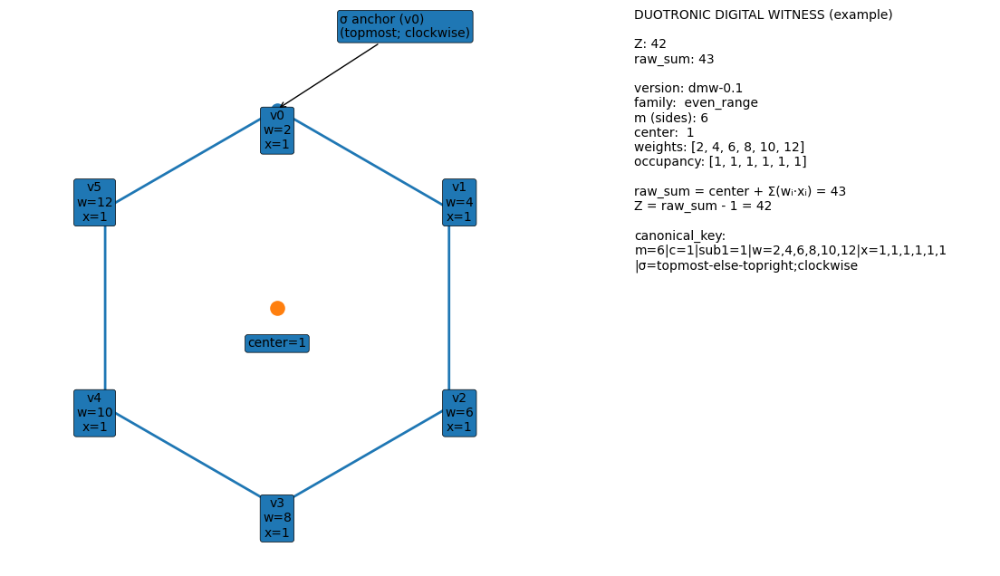

# Duotronic Bus Protocol (DBP)

DBP is a fixed-shape binary protocol for real-time state fanout.

- Frame size: `4096` bytes
- Shape: `1024` IEEE-754 Float32 cells
- Model: positional multiplexing by fixed cell offsets
- Status: active `v1.x` line development (`v1.1` legacy snapshot retained)

DBP treats a frame as three things at once:
- a transport payload,
- a deterministic state snapshot,
- a vector-friendly numeric object.

## Why DBP

Most real-time systems split responsibilities across multiple channels and formats. DBP collapses that into one primitive: the frame. Instead of message parsing and schema negotiation at runtime, DBP uses fixed positions with known semantics.

Tradeoff accepted by design:
- fixed overhead per frame,
- simpler receiver logic,
- deterministic decode and validation behavior.

## Canonical Documents

Use these as the authoritative source set:

- Protocol reference: `./protocol/duotronic-bus.md`
- Duotronic Math v2 reference: `./protocol/ref/duotronic-math-v2.md`
- WSB2 reference encoder/decoder (JS): `./protocol/wsb2_ref.mjs`
- WSB2 reference encoder/decoder (Python): `./protocol/wsb2_ref.py`
- Legacy v1.1 snapshot archive: `./protocol/ref/duotronic-bus-spec-v1.1-legacy.md`

Companion working-theory paper:
- `./protocol/ref/A Framework for a Unified Data Model - From Quantum Mechanics to General Relativity via Duotronic Mathematics.md`

## Digital Witness (DM layer)

DBP can transport witness-encoded semantics from Duotronic Math. A witness is an 8-feature object that carries value plus structural context.

<p align="center">
  
  <br>
  <b>Figure:</b> Example digital witness geometry used in the optional Duotronic Math layer.
</p>

Practical rules:
- Witness feature order is fixed and profile-governed.
- Token-free zero (`[0,0,0,0,0,0,0,0]`) means absence, not numeric zero.
- Structural DBP cells (header/trailer/footer and other profile-structural integer lanes) MUST NOT be witness-encoded.
- If sparse transport is needed, use `WSB2` over authenticated ABB `opaque_bytes` lanes (Option B).

Primary references:
- `./protocol/ref/duotronic-math-v2.md`
- `./protocol/wsb2_ref.mjs`
- `./protocol/wsb2_ref.py`

## Frame Layout (v1.x)

| Region | Cells | Bytes | Class |
|---|---:|---:|---|
| Band 0 (header) | `0..8` | `0..35` | Structural |
| Band 1 (lattice) | `9..19` | `36..79` | Semantic |
| Band 2 (Digital A) | `20..83` | `80..335` | Semantic |
| Band 3 (Digital B) | `84..147` | `336..591` | Semantic |
| Band 4 (quantum register) | `148..275` | `592..1103` | Semantic |
| Band 5 (waveform/digest) | `276..659` | `1104..2639` | Semantic |
| Band 6 (client/MUX) | `660..999` | `2640..3999` | Semantic/profile-structural |
| Band 6T (security trailer) | `1000..1019` | `4000..4079` | Structural |
| Band 7 (footer) | `1020..1023` | `4080..4095` | Structural |

### Core invariants

- Wire endianness is little-endian.
- Frame length MUST be exactly `4096` bytes.
- Structural fields MUST be raw integer-as-float where specified.
- Structural fields MUST NOT be witness-encoded.

## Security Profiles

- `sec_profile=0` Open: CRC only.
- `sec_profile=1` S1: authenticity + replay checks.
- `sec_profile=2` S2: confidentiality + authenticity + replay policy.

S2 high-level scope:
- ciphertext: cells `9..999`
- cleartext structural controls: Band 0, `1000..1003`, and policy cells `1018..1019`
- S2 AAD order: cells `0..8`, then `1000..1003`, then `1018..1019`

CRC policy:
- CRC32 is required in all modes.
- CRC flavor: `CRC-32/ISO-HDLC`.

## Integer-as-Float Decode Rule (critical)

For u16/u24 structural fields, receivers must verify:

1. finite
2. not subnormal
3. integral (no fractional part)
4. in range (`u16: 0..65535`, `u24: 0..16777215`)
5. round-trip exactness at Float32 precision

Hardened profile behavior:
- `-0.0` in structural integer fields is forbidden and rejected.

## Validation Pipeline (receiver)

Minimum strict order:

1. shape check (`4096` bytes)
2. structural integer preflight (`magic`, header/footer/trailer ints)
3. CRC verify over `bytes[0..4079]`
4. secure profile verification (S1 HMAC or S2 AEAD)
5. in S2, decrypt `9..999`
6. parse authenticated ABB manifest/MCB if present
7. derive `opaque_bytes` exclusion mask if used
8. numeric checks + semantic band decode

## Digital Channels and Capacity

Digital payload model:
- each `u24` cell carries 3 bytes
- each digital band has 64 cells, with 8-cell channel header
- payload per digital channel: `56 * 3 = 168` bytes
- base two-channel payload per frame: `336` bytes

## ABB (Adaptive Band Borrowing)

ABB lets profiles lease inactive donor bands without changing frame shape.

Donor bands:
- Band 4 (`148..275`)
- Band 5 (`276..659`)
- Band 6 (`660..999`)

Hard rules:
- no overlap with structural regions
- lease metadata must be authenticated
- native donor semantics take precedence
- in hardened MUX, fixed MCB occupies `660..683` and is non-borrowable

Lane types (hardened S2+MUX registry):
- `1 = digital_u24`
- `2 = analog_f32`
- `3 = quantum_pair`
- `4 = opaque_bytes` (S2 only)

### ABB capacity (digital_u24 mode)

- base digital (Band 2 + 3 payload): `336` bytes/frame
- + Band 4 max: `+384`
- + Band 5 max: `+1152`
- + Band 6 max: `+1020`
- theoretical max: `2892` bytes/frame

Hardened MUX adjustment:
- Band 6 effective borrow max: `316` cells (`948` bytes)
- hardened total with Band 4 + 5 + 6: `2820` bytes/frame

## WSB2 Sparse Witness Transport (Option B)

WSB2 is a sparse witness payload format designed for ABB `opaque_bytes` lanes.

Use case:
- keep semantic model dense (`R x 8` witness rows),
- transport sparse present rows only,
- preserve constant-time lookup locally via `row_to_dense` index.

WSB2 payload structure:
- header `16` bytes:
  - `magic='WSB2'`
  - `version`
  - `overlay_id`
  - `rows=R`
  - `cols=8`
  - `present=K`
  - `flags`
- bitmap: `ceil(R/8)` bytes
- packed data: `K * 8 * 4` bytes (Float32 LE)
- optional body CRC32

Sizing:
- dense bytes: `R * 8 * 4`
- sparse bytes: `16 + ceil(R/8) + (K * 32)` (+ optional CRC)

Example:
- `R=64`, `K=8`
- dense: `2048` bytes
- sparse: `280` bytes

Reference implementations:
- JS: `./protocol/wsb2_ref.mjs`
- Python: `./protocol/wsb2_ref.py`

## Duotronic Math Layer (optional)

DBP can carry raw semantic values directly, or witness-based representations from Duotronic Math.

Core witness concepts:
- token-free zero means semantic absence,
- explicit numeric zero must not collapse to token-free zero,
- profile must define family mapping and decode contracts.

See:
- `./protocol/ref/duotronic-math-v2.md`

## Repo Layout

```text
protocol/
  duotronic-bus.md                    # Canonical protocol reference
  wsb2_ref.mjs                        # WSB2 JS reference
  wsb2_ref.py                         # WSB2 Python reference
  dbp_ref.mjs                         # Shared JS protocol helpers
  digital-witness.png                 # Visualization asset
  dmw_test_vectors.json               # Witness vectors
  DBP Profile Template.md             # Profile authoring template
  ref/
    duotronic-math-v2.md              # Canonical DM v2 reference
    duotronic-bus-spec-v1.1-legacy.md # Legacy archive
    A Framework for a Unified Data Model - From Quantum Mechanics to General Relativity via Duotronic Mathematics.md
```

## Quick Start

### 1) Verify WSB2 references

```bash
node protocol/wsb2_ref.mjs
python protocol/wsb2_ref.py
```

### 2) Read protocol first

- `protocol/duotronic-bus.md`

### 3) Read semantic layer

- `protocol/ref/duotronic-math-v2.md`

## Implementation Checklist (condensed)

- parse exactly `4096` bytes
- validate structural integer-as-float fields strictly
- verify CRC in all modes
- verify S1/S2 before semantic trust
- enforce replay and downgrade policy in hardened profiles
- in S2 + ABB `opaque_bytes`, exclude leased slices from float-class checks
- decode semantic bands only after all required checks pass

## Known Operational Guidance

- Atomic publish recommended (`write temp -> rename`).
- For pull transport, prefer ETag validation.
- For high fanout, SSE/WebSocket relay can reduce latency.
- Keep key rotation/replay state durable in hardened secure deployments.

## Compatibility and Evolution

- `v1.x` remains fixed-shape Float32 frame line.
- Legacy v1.1 snapshot is retained for archive/regression purposes.
- Active protocol evolution is documented in `protocol/duotronic-bus.md` and supporting references.

## License

See `LICENSE`.
